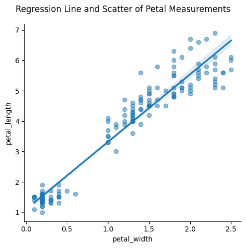
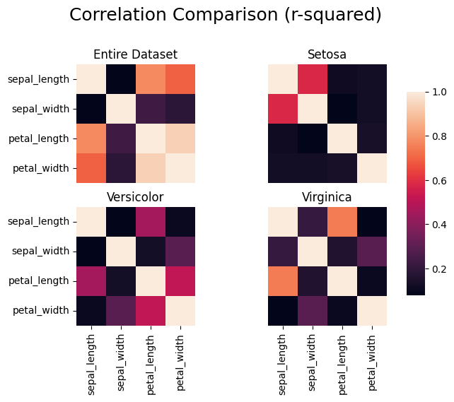

# Correlation Analysis of Iris Flower Size

## Statistical Analysis Report Based on the Iris Flower Dataset

 

A report on findings from investigating correlation between measurements of Iris flower petal and sepal measurements. More specifically centered on whether a significant linear relationship can be found between Iris petal width and length, as well as Iris sepal width and length.

  

### Table of Contents

[Dataset Explanation](#dataset-explanation)  
[Hypothesis](#hypothesis)  
[Utforande](#utforande)  
[Analysis](#analysis)  
&nbsp;&nbsp;&nbsp;&nbsp;&nbsp;&nbsp;[Petal](#petal)  
&nbsp;&nbsp;&nbsp;&nbsp;&nbsp;&nbsp;[Sepal](#sepal)  
&nbsp;&nbsp;&nbsp;&nbsp;&nbsp;&nbsp;[Correlation](#correlation)  
&nbsp;&nbsp;&nbsp;&nbsp;&nbsp;&nbsp;[Correlation Test](#correlation-test)  
&nbsp;&nbsp;&nbsp;&nbsp;&nbsp;&nbsp;[Hypothesis Evaluation](#hypothesis-evaluation)  
&nbsp;&nbsp;&nbsp;&nbsp;&nbsp;&nbsp;[In-Sample Prediction](#in-sample-prediction)  
[Conclusion](#conclusion)  

  

# Dataset Explanation

TODO:  

Iris Dataset [link to dataset]  

Image(s) describing columns, what petal and sepal is  

[Back to top](#table-of-contents)

  

# Hypothesis

Hypotheses going into this analysis:  

 

### 1. Petal Hypothesis  

There is a significant relationship between petal length and width  

$H_0: \rho = 0$  
$H_A: \rho \neq 0$  
$\alpha = 0.5$  

 

### 2. Sepal Hypothesis  

There is a significant relationship between sepal length and width  

$H_0: \rho = 0$  
$H_A: \rho \neq 0$  
$\alpha = 0.5$  

 

[Back to top](#table-of-contents)

  

# Execution

### Planned course of action going into analysis:  

 

1. Look at point distribution of petal and sepal values in order to get a brief overview of whether there seems to be a linear relationship or not.

2. Look at bivariate correlation between width and length of petals and sepals respectively.

3. Determine significance by looking at p-values.

4. Evaluate whether sufficiently significant correlation can be proven for a linear regression model to be used.

5. Use linear regression model for point prediction.

 

[Back to top](#table-of-contents)

  

# Analysis

## Petal

Looking at petal point distribution, there seems to be a linear relation between width and length

  

## Sepal

Looking at sepal point distribution, we see a negative regression line. However, the points are widely spread out and there does not seem to be a linear relation between them.

Instead, looking at the points divided by species, we can see what seems to be a more clear relation in the point distribution.

  

## Correlation

Looking at a correlation heatmap of the entire dataset and the various species, we get to confirm some of the observations from earlier.

The correlation between sepal width and length across the entire dataset is indeed close to zero. Dividing the dataset on subspecies does have a stronger correlation, but perhaps not as strong as it might have looked in the previous figure.  
Out of the three species, only versicolor shows a correlation at around 0.5.

The correlation between petal width and length across the entire dataset is strong as suspected from looking at the point distribution. Interestingly however, dividing on species we see a much weaker correlation between petal measurements.

Notes:  

- The plot shows r-squared values

  

## Correlation Test

Calculating bivariate correlation

Correlation between petal width and lengt: 

> r = 0.9628, p = 0.0000  

A very strong positive correlation, and an extremely low p-value

 

Correlation between sepal width and length: 

> r = -0.1094, p = 0.1828  

A weak negative correlation, and a very high p-value

  

## Hypothesis Evaluation

Given p-values from correlation tests, the hypotheses can be evaluated as follows:

### 1. Petal Hypothesis  

$H_0: \rho = 0$  
$H_A: \rho \neq 0$  
$\alpha = 0.05$  

$p = 0.0000 \rightarrow p \lt \alpha \rightarrow \text{reject } H_0$  

Thus there is sufficient evidence to conclude that there is a significant linear relationship between petal width and length because the correlation coefficient is significantly different from zero.

 

### 2. Sepal Hypothesis

$H_0: \rho = 0$  
$H_A: \rho \neq 0$  
$\alpha = 0.05$  

$p = 0.1828 \rightarrow p \gt \alpha \rightarrow \text{can not reject } H_0$  

Thus there is insufficient evidence to conclude that there is a significant linear relationship between petal width and length because the correlation coefficient is not significantly different from zero.

  

## In-Sample Prediction

Since the correlation was proven significant for petals, it can be used for prediction.  

describe model here --- using OLS

Generating random width measurements between the dataset's min and max values, the model will output predictions as shown in below figure:

However, something worth noting is the gap in data between the smaller measurements (setosa) and the larger ones (versicolor and virginica).  

In the dataset there are no datapoints for that range, one might reason if several flowers with a petal width in that gap were found, their average petal length would be near the prediction line.

A point could be made however about the correctness of such assumptions, especially considering the correlation between petal width and length for individual species not being very strong.  

A point could be made here about the correctness of the predictions in this range, especially considering the correlation between width and length for the individual species not being very strong.

 

[Back to top](#table-of-contents)

  

# Conclusion

TODO: finish writing conclusion, this is just a quickly noted down draft of findings

Findings:

> There is a strong correlation between petal width and length

A model to linearly predict petal measurements can be used as there is a significant linear relationship between petal width and length.

 

> There is not a strong correlation between sepal width and length

A linear model does not fit the relation between sepal width and length. Correlation of a significant degree can not be proven.

Separating sepals based on species might give a stronger correlation and be a more optimal method for regression. At least in the case of Iris setosa.

 

[Back to top](#table-of-contents)