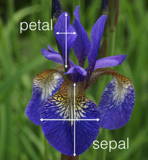
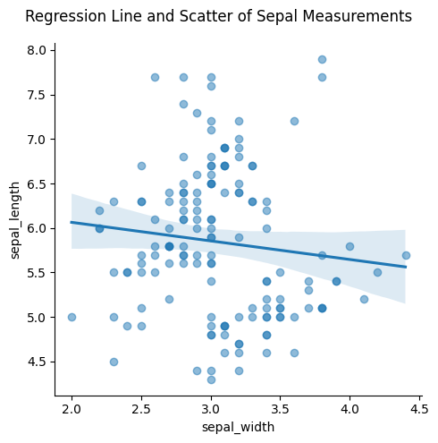
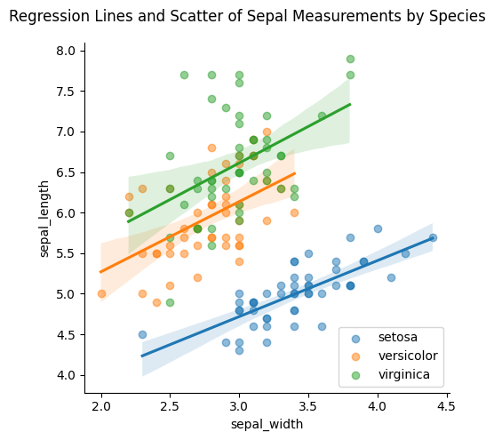
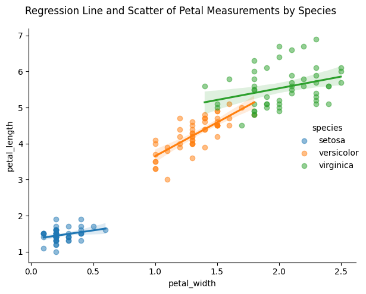
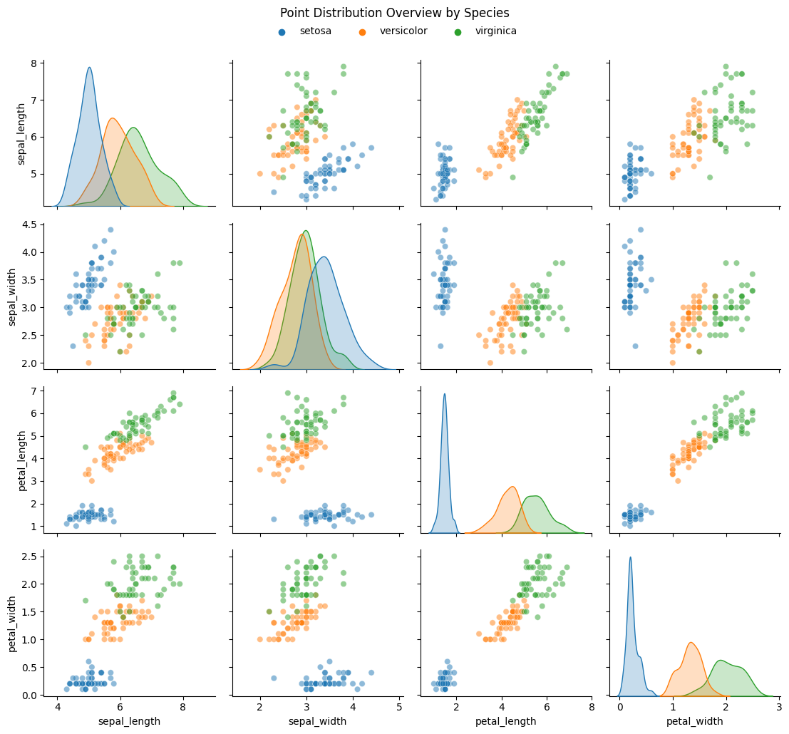
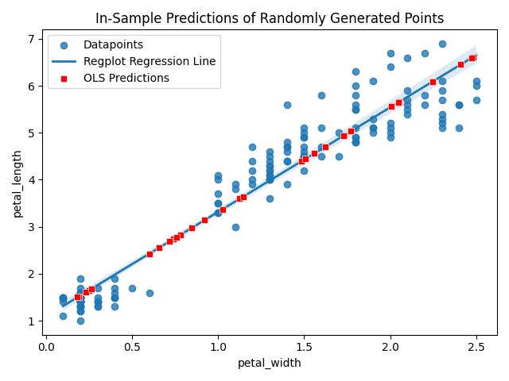

# Correlation Analysis of Iris Flower Measurements

## A Report Based on the Iris Flower Dataset

 

Statistical Analysis by [Andreas Svensson](https://github.com/Andreas-Svensson)

 

A report on findings from investigating correlation between measurements of Iris flower petals and sepals. More specifically on whether significant correlation can be found between Iris petal width and length, as well as Iris sepal width and length. And if a linear regression model would be suitable for describing these relations.  

 

### Table of Contents

[Dataset Explanation](#dataset-explanation)  
[Hypothesis](#hypothesis)  
[Approach](#approach)  
[Analysis](#analysis)  
&nbsp;&nbsp;&nbsp;&nbsp;&nbsp;&nbsp; [Petal](#petal)  
&nbsp;&nbsp;&nbsp;&nbsp;&nbsp;&nbsp; [Sepal](#sepal)  
&nbsp;&nbsp;&nbsp;&nbsp;&nbsp;&nbsp; [Correlation](#correlation)  
&nbsp;&nbsp;&nbsp;&nbsp;&nbsp;&nbsp; [Correlation Test](#correlation-test)  
&nbsp;&nbsp;&nbsp;&nbsp;&nbsp;&nbsp; [Hypothesis Evaluation](#hypothesis-evaluation)  
&nbsp;&nbsp;&nbsp;&nbsp;&nbsp;&nbsp; [In-Sample Prediction](#in-sample-prediction)  
[Conclusion](#conclusion)  

  

# Dataset Explanation

Data used is the [Iris Flower Dataset](https://www.kaggle.com/datasets/arshid/iris-flower-dataset) from Kaggle.

The dataset contains measurements of 150 Iris flowers, with 50 flowers each from the 3 subspecies Iris Setosa, Iris Versicolor, and Iris Virginica.

Each measurement includes: (im mm)
- Petal Width  
- Petal Length  
- Sepal Width  
- Sepal Length  

As described by the image below

 

[Back to top](#table-of-contents)

  

# Hypothesis

Hypotheses going into this analysis:  

 

### 1. Petal Hypothesis  

There is a significant correlation between petal length and width  

$H_0: \rho = 0$  
$H_A: \rho \neq 0$  
$\alpha = 0.05$  

 

### 2. Sepal Hypothesis  

There is a significant correlation between sepal length and width  

$H_0: \rho = 0$  
$H_A: \rho \neq 0$  
$\alpha = 0.05$  

 

[Back to top](#table-of-contents)

  

# Approach

### Planned course of action going into analysis:  

 

1. Look at point distribution of petal and sepal values in order to get a brief overview of whether there seems to be a linear relationship or not. In order to correctly analyse the results in coming stages, it will be important to have looked at point distribution to understand the values based on point distribution.  

2. Look at bivariate correlation (pearson's r) between width and length of petals and sepals respectively. 

3. Determine significance of correlation by evaluating hypotheses based on given r and p-values. A high r and low p-value would point towards strong correlation, and significance is determined by comparing p-value to significance level determined in hypotheses.  

4. Use linear regression model for point prediction if significant correlation was found. 

 

[Back to top](#table-of-contents)

  

# Analysis

Step-by-step walkthrough of analysis.

## Petal

First looking at petal point distribution, it looks like the relation between petal width and length is linear. Though there is a gap with no measurements, the overall trend does seem linear in nature.  

  

## Sepal

Moving on to sepal point distribution, there does not seem to be any correlation between the values. The regression plot shows a regression line, however the points are widely spread out and there does not seem to be a linear relation between them.  

Instead, looking at sepal data divided by species might give a better explanation for the relation between points. This plot seems to better explain the relation between width and height, and at least in the case of Iris setosa there appears to be some correlation.  

  

## Correlation

Looking at a correlation heatmap of the entire dataset and the various species, some of the earlier observations can be seen in this representation as well: 

For sepals, the correlation between width and length across the entire dataset is indeed close to zero. Dividing the dataset on subspecies does not change this, except for versicolor which shows some correlation.  

For petals, there is a correlation between width and length as seen earlier. Interestingly however, dividing on species shows a much weaker correlation between petal measurements.  

Notes:  

- The plot shows r-squared values in order to show strength of correlation only. Instead of an r-value that ranges from -1 to 1, r-squared ranges from 0 to 1, where values towards 0 shows weaker and towards 1 shows stronger correlation. As the focus of this report is to discern whether there is a correlation or not, regardless of whether it is a positive or negative correlation, r-squared was deemed the most relevant and clear way to display correlation in this case.  

 

Based on the observation of dividing petals by species showing much weaker (if any) correlation, a scatter plot with regression lines explains this relation more in detail. Versicolor seems to have some correlation, while setosa and virginica are much too spread out and not following the regression line closely. In fact, it almost looks like setosa petals has an independent relation between width and height, as most of the datapoints have the same width measurement regardless of length.  

Straying slightly from the topic, but an interesting observation none the less, this close to independent relation between measurements for setosa can be further observed by looking at all possible variable combinations. The 4 subplots in the bottom left corner all seem to show a relation where, as the value of x changes, the value of y remains roughly the same.

  

## Correlation Test

Calculating bivariate correlation using pearsonr from scipy.stats  

 

Correlation between petal width and length:  

> r = 0.963, p = 5.7766609884957695e-86

Strong positive r-value and p-value < 0.001 shows a positive, strong correlation between petal width and length.  

 

Correlation between sepal width and length:  

> r = -0.109, p = 0.18276521527134995

Weak negative r-value and high p-value shows no correlation between sepal width and length.  

  

## Hypothesis Evaluation

Given p-values from performed correlation tests, the hypotheses can be evaluated as follows:

### 1. Petal Hypothesis  

$H_0: \rho = 0$  
$H_A: \rho \neq 0$  
$\alpha = 0.05$  

$p = 0.0000 \rightarrow p \lt \alpha \rightarrow \text{reject } H_0$  

Thus there is sufficient evidence to conclude that there is a significant correlation between petal width and length.  

 

### 2. Sepal Hypothesis

$H_0: \rho = 0$  
$H_A: \rho \neq 0$  
$\alpha = 0.05$  

$p = 0.1828 \rightarrow p \gt \alpha \rightarrow \text{can not reject } H_0$  

Thus there is insufficient evidence to conclude that there is a significant correlation between petal width and length.  

  

## In-Sample Prediction

Since the correlation was proven significant for Iris petals, it can be used for prediction. In this case using OLS for a linear regression model, training based on points in the dataset, and using it to perform in-sample prediction. In-sample meaning y-value predictions based on x-values that are within the span of this dataset. Values outside the dataset could also be predicted, but the accuracy of the model would be lower, especially for points that are far outside the span, as there is not way to confidently tell that the trends observed in the data hold true outside of it as well.  

Below, 30 randomly generated x-values (width) for petals between the dataset's min and max width values are drawn on top of the regression plot for petals from earlier. The model predicts y-values (length) of each input x-value and they all fall, as expected, on the regression line.  

However, something worth noting is the gap in data between the smaller measurements (setosa) and the larger ones (versicolor and virginica).  

In the dataset there are no datapoints for this range. Based on the fact that individual species, except for versicolor, show no correlation, petals found with measurements falling within this range might not be predicted accurately. As measurements in that range seem rare, however, it would likely not affect the overall accuracy of the model, thought it might be worth noting.  

 

[Back to top](#table-of-contents)

  

# Conclusion

As per the intent of the project, the relationship between width and length measurements of petals and sepals respectively have been analysed, with the analysis coming to the following conclusions:  

 

For petal measurements:

> There is a significant correlation between petal width and length

A linear regression model is well suited to predict petal measurements as there is a significant correlation between petal width and length.  

Note however, that there is a gap in the data which might result in inaccurate predictions for values in that range. Also, dividing the dataset by species, the correlation is much weaker. This is something worth considering if one is to use such a model.  

 

For sepal measurements:

> A significant correlation could not be proven between sepal width and length

A linear regression model can not be said to be well suited to predict sepal measurements as a significant correlation between sepal width and length could not be proven.  

Separating sepals based on species might give a stronger correlation and be a more optimal method for regression. At least in the case of Iris setosa.  

 

[Back to top](#table-of-contents)